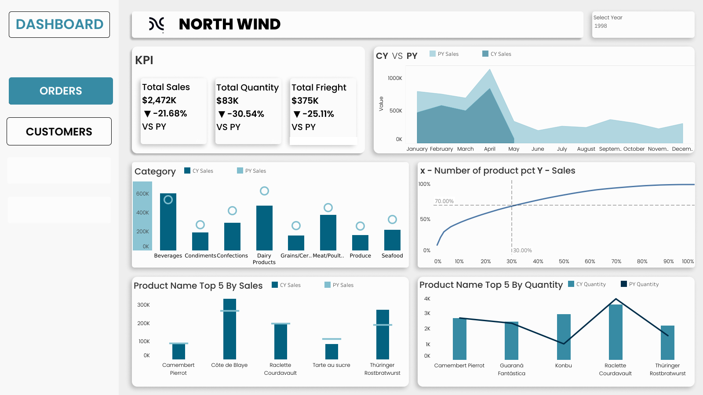
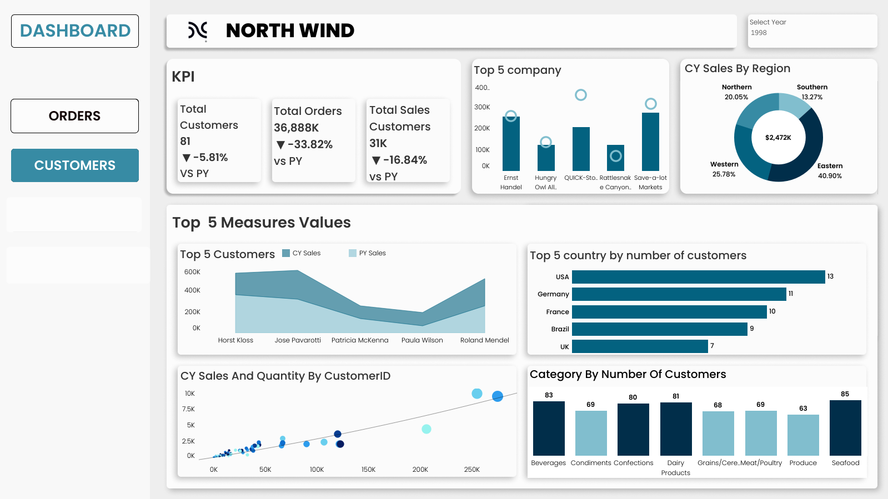

# North Wind 

**Following is the dashboard for the North Wind traders**

**Employees dashboard**

* The first dashboard shows the **KPI** of the orders dimensions : Sales, Quantity, Freight .
* The secound dashboard shows the staked area chart for the CY sales and PY sales.
* The 3rd chart shows the category by the cy sales and py sales.
* The 4 visual show the perriot char of the 30% of the product sold  generate the 70% percent of the sales
* 5th chart shows the product name by the cy sales and  py sales 
* The last chart shows  the  product name by the cy quantity and py quantity

**Customers dashboard**

* The first visulization represent the **KPI** for the selected year.
* The secound Visualization presents the top 5 company by CY sales of the company.
* 3rd visual shows the sales by the regions
* The following 4 visuals shows top 5 measures by te customers,country, sales and quantity  by customer_id and category by no.of customers

